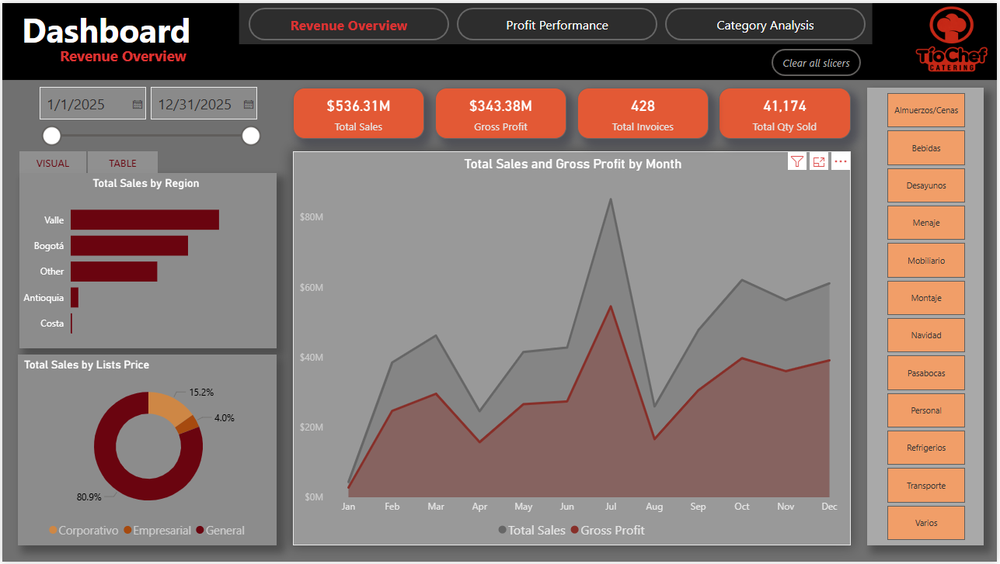
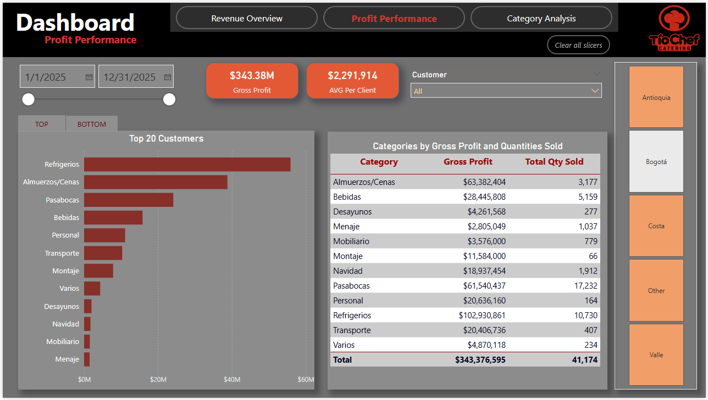
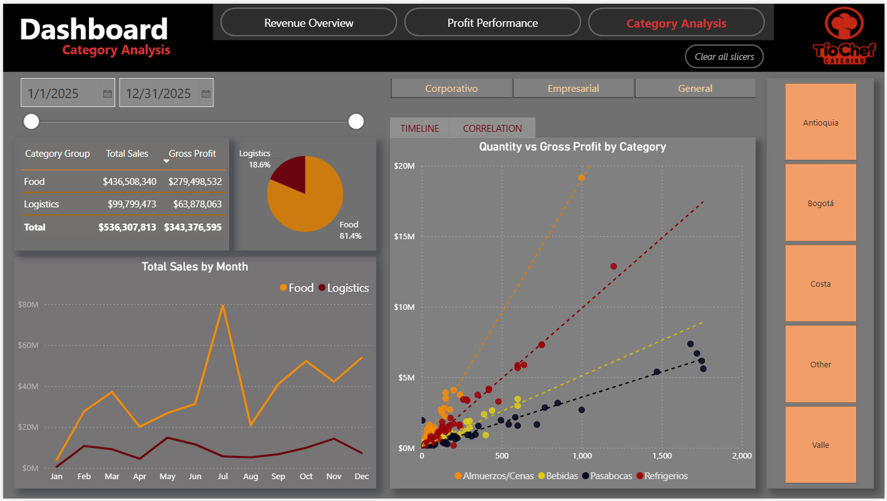

# TioChef Business Intelligence Solution

## Transforming Manual Data into an Automated Analytics System

### Project Overview
This project transformed TioChef's manual data processes into a structured
business intelligence solution designed to improve reporting and support
data-driven decision-making.

### Business Objective
Create an automated analytics system that organizes sales and operational
data and provides clear visibility into business performance.

### Tools & Technologies
- Power BI
- Power Query
- DAX
- Data Modeling
- Data Visualization
- Excel

### Solution
I designed a star schema with a central Fact_Sales table connected to
dimension tables for customers, products, invoices, warehouses, and dates.

I developed measures and interactive dashboards to analyze sales,
costs, profitability, invoices, products, and business trends.

### Key Metrics
- Total Sales
- Total Cost
- Gross Profit
- Gross Profit %
- Top customers

### Dashboard
## Dashboard

### Revenue Overview

### Profit Performance

### Category Analysis

### Data Model
Data model diagram will be added here.
